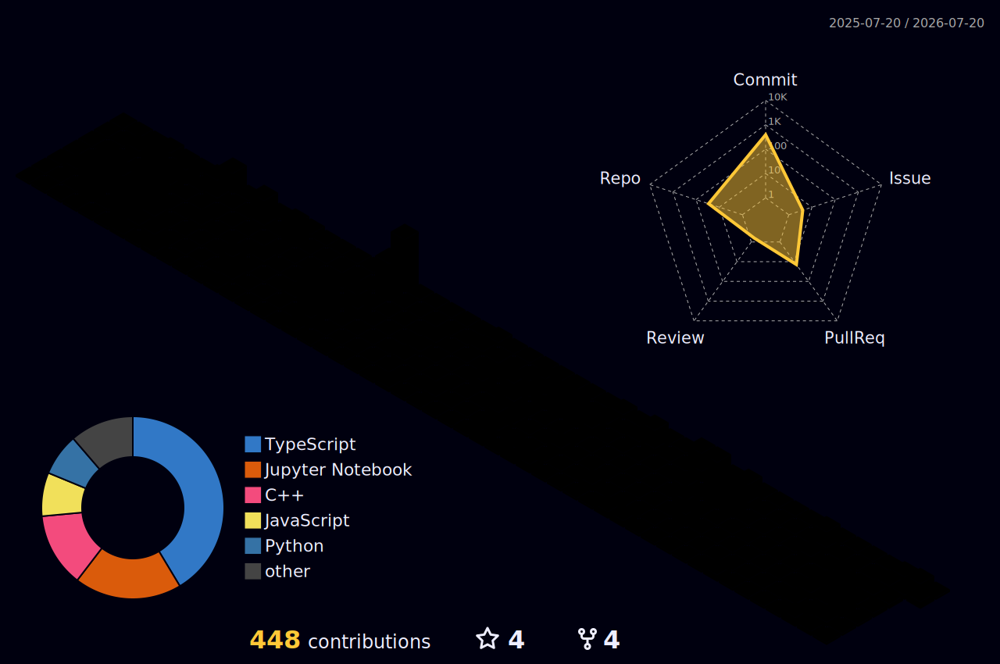

<!-- 🍪 Vishard Mehta — profile README -->

<!-- ══════════════════════════════════════════════════════════════
     TWO HEADER OPTIONS — pick one, delete the other.
     A = cookie gets eaten (bites + falling crumbs)
     B = cookie bakes (progress ring + steam)
     ══════════════════════════════════════════════════════════════ -->

<!-- ▼▼▼ OPTION A — THE COOKIE GETS EATEN ▼▼▼ -->
<p align="center">
  
</p>

<!-- ▼▼▼ OPTION B — THE COOKIE BAKES ▼▼▼ -->

<p align="center">
  
</p>

<p align="center">
  
</p>

<!-- 🟡 PACMAN eats the contribution graph -->
<picture>
  <source media="(prefers-color-scheme: dark)" srcset="https://raw.githubusercontent.com/vishardmehta/vishardmehta/output/pacman-contribution-graph-dark.svg">
  <source media="(prefers-color-scheme: light)" srcset="https://raw.githubusercontent.com/vishardmehta/vishardmehta/output/pacman-contribution-graph.svg">
  
</picture>

## `> whoami`

CSE undergrad at **Thapar Institute** (class of '27). I build ML systems that actually ship — multi-agent NL→SQL engines, real-time pose-based exercise classifiers, and quant models that trade live on Numerai.

- 🔭 **Currently:** deep in C++ DSA, refining regime-detection ensembles, shipping side projects faster than I can name them
- ⚡ **Comfort zone:** anywhere the math meets the machine — model design, backends, and the glue in between
- 🎯 **Chasing:** ML/AI research + engineering roles where the problems are hard and the feedback loops are fast

<p align="center">
  
</p>

## `> stack --list`

<div align="center">

**Languages**


**ML & Data**


**Web & Tools**


</div>

<p align="center">
  
</p>

## `> git log --stat`

<!-- Streak card is hotlinked (demolab is reliable). The other two are
     generated by .github/workflows/stat-cards.yml and read from ./cards/
     so they can never rate-limit. Do NOT wrap these in <div> — GitHub
     won't render markdown images inside HTML block tags. -->

<p align="center">
  
</p>

<p align="center">
  
</p>

<p align="center">
  
</p>

<!-- 🏙️ 3D contribution city -->
<p align="center">
  
</p>

<p align="center">
  
</p>

## `> ls ./projects`

| Project | What it does | Built with |
|---|---|---|
| 🧠 **Querix** | Multi-agent natural-language → SQL engine with RAG over schemas | LangChain · FAISS · Llama 3.x · FastAPI · React/TS |
| 🏋️ **Fitify** | Real-time exercise classification from webcam pose landmarks | BlazePose · Bidirectional GRU · ONNX |
| 🌾 **BazaarGrid** | Village-branded agri-commerce platform, designed end-to-end | Full-stack · UML-first system design |
| 📝 **Textdrop** | Minimal text sharing on the web → [try it](https://textdrop.vercel.app/) | Vercel |

## `> cat achievements.txt`

```text
[✓] Numerai  — top 12% global rank, live MoE ensembles with regime routing
[✓] Kaggle   — Expert ×2 (Notebooks + Datasets)
[✓] Research — co-authored a conference paper on tabular ML benchmarks
```

<p align="center">
  
</p>

## `> ping vishard`

<div align="center">
  <a href="https://vishardmehta.vercel.app/"></a>
  <a href="mailto:vishard2005@gmail.com"></a>
  <a href="https://www.linkedin.com/in/vishard-mehta-367011290/"></a>
  <a href="https://www.instagram.com/vishard_mehta/"></a>
</div>

<br>m

<div align="center">
  
</div>
